```mermaid
graph TD
    researcher[🤖 researcher]
    
    subgraph Tools
        search[🔧 search]
        analyze[🔧 analyze]
        summarize[🔧 summarize]
    end
    
    subgraph Capabilities
        WebSearch[🌐 WebSearch]
        FileSystem[📁 FileSystem]
    end
    
    researcher --> Tools
    researcher --> Capabilities
```

# Graph Module

The `cogent.graph` module provides unified visualization for agents, patterns, and flows.

## Overview

Visualize any entity as a diagram:

```python
from cogent import Agent

agent = Agent(name="assistant", model=model, tools=[search, write])

# Get graph view
view = agent.graph()

# Render in any format
print(view.mermaid())   # Mermaid code
print(view.ascii())     # Terminal-friendly
print(view.dot())       # Graphviz DOT
print(view.url())       # mermaid.ink URL
print(view.html())      # Embeddable HTML

# Save to file
view.save("diagram.png")
view.save("diagram.svg")
```

---

## GraphView API

All entities return a `GraphView` from their `.graph()` method:

### Rendering Methods

```python
view = agent.graph()

# Mermaid diagram code
mermaid_code = view.mermaid()
print(mermaid_code)
# graph TD
#   assistant[assistant]
#   search[🔧 search]
#   write[🔧 write]
#   assistant --> search
#   assistant --> write

# ASCII art for terminal
ascii_art = view.ascii()
print(ascii_art)
# ┌─────────────┐
# │  assistant  │
# └──────┬──────┘
#    ┌───┴───┐
#    ▼       ▼
# [search] [write]

# Graphviz DOT format
dot_code = view.dot()

# mermaid.ink URL (shareable)
url = view.url()
print(url)  # https://mermaid.ink/img/...

# Embeddable HTML
html = view.html()
```

### Saving Diagrams

```python
# Auto-detect format from extension
view.save("diagram.png")    # PNG image
view.save("diagram.svg")    # SVG vector
view.save("diagram.mmd")    # Mermaid source
view.save("diagram.dot")    # Graphviz DOT
view.save("diagram.html")   # HTML page

# Explicit format
view.save("output", format="png")
```

---

## Agent Graphs

Visualize agent structure:

```python
from cogent import Agent
from cogent.capabilities import WebSearch, FileSystem

agent = Agent(
    name="researcher",
    model=model,
    tools=[search, analyze, summarize],
    capabilities=[WebSearch(), FileSystem()],
)

view = agent.graph()
print(view.mermaid())
```

Output:


---

## Pattern Graphs

Visualize multi-agent patterns using `FlowGraph`:

### Supervisor

```python
from cogent.flow import supervisor
from cogent.graph import FlowGraph

flow = supervisor(coordinator=manager, workers=[analyst, writer, reviewer])

graph = FlowGraph.from_flow(flow)
print(graph.render())  # Mermaid by default
```

### Pipeline

```python
from cogent.flow import pipeline
from cogent.graph import FlowGraph

flow = pipeline([researcher, writer, editor])

graph = FlowGraph.from_flow(flow)
print(graph.render())
```

### Mesh

```python
from cogent.flow import mesh
from cogent.graph import FlowGraph

flow = mesh([analyst1, analyst2, analyst3], max_rounds=3)

graph = FlowGraph.from_flow(flow)
print(graph.render())
```

---

## Flow Graphs

Visualize custom event-driven flows:

```python
from cogent import Flow, react_to
from cogent.graph import FlowGraph

flow = Flow(name="content-pipeline")
flow.register(researcher, [react_to("task.created")])
flow.register(writer, [react_to("researcher.completed")])

graph = FlowGraph.from_flow(flow)
print(graph.render())
```

---

## Configuration

### GraphConfig

```python
from cogent.graph import GraphConfig, GraphTheme, GraphDirection

config = GraphConfig(
    direction=GraphDirection.TOP_DOWN,  # or LEFT_RIGHT
    theme=GraphTheme.DEFAULT,           # or DARK, FOREST, NEUTRAL
    show_tools=True,
    show_capabilities=True,
    show_interceptors=False,
    node_spacing=50,
    rank_spacing=100,
)

view = agent.graph(config=config)
```

### GraphDirection

| Direction | Description |
|-----------|-------------|
| `TOP_DOWN` | Vertical, top to bottom (TD) |
| `LEFT_RIGHT` | Horizontal, left to right (LR) |
| `BOTTOM_UP` | Vertical, bottom to top (BU) |
| `RIGHT_LEFT` | Horizontal, right to left (RL) |

### GraphTheme

| Theme | Description |
|-------|-------------|
| `DEFAULT` | Standard colors |
| `DARK` | Dark background |
| `FOREST` | Green tones |
| `NEUTRAL` | Grayscale |

---

## Execution Graphs

Visualize execution traces:

```python
from cogent.observability import ExecutionTracer

tracer = ExecutionTracer()
result = await agent.run("Query", tracer=tracer)

# Get execution graph
view = tracer.graph()
print(view.mermaid())
```

Output:


---

## ASCII Rendering

Terminal-friendly diagrams:

```python
view = topology.graph()
print(view.ascii())

# Output:
# ┌─────────────┐
# │   manager   │
# └──────┬──────┘
#        │
#   ┌────┼────┐
#   ▼    ▼    ▼
# [ana] [wri] [rev]
```

### DAG ASCII Rendering

```python
from cogent.observability import render_dag_ascii

dag = {
    "A": ["B", "C"],
    "B": ["D"],
    "C": ["D"],
    "D": [],
}

print(render_dag_ascii(dag))
```

---

## Interactive Viewing

Open in browser:

```python
view = agent.graph()

# Open mermaid.ink in default browser
view.open()

# Or get URL to share
url = view.url()
print(f"View at: {url}")
```

---

## Integration

### Jupyter Notebooks

```python
from cogent import Agent

agent = Agent(name="assistant", model=model)
view = agent.graph()

# Display inline in notebook
view.display()

# Or use IPython display
from IPython.display import HTML
HTML(view.html())
```

### VS Code

```python
# Save as .mmd file for Mermaid preview extension
view.save("diagram.mmd")
```

### Documentation

```markdown
# My Agent Architecture

```mermaid
{view.mermaid()}
```
```

---

## KnowledgeGraph Visualization

Visualize knowledge graphs with entity grouping and custom layouts:

```python
from cogent.capabilities import KnowledgeGraph

kg = KnowledgeGraph()

# Add entities and relationships
kg.remember("Alice", "Person", {"role": "CEO"})
kg.remember("TechCorp", "Company", {"founded": 2015})
kg.connect("Alice", "works_at", "TechCorp")

# Visualize with layout options
view = kg.visualize(
    direction="LR",          # Left-to-right (also: TB, BT, RL)
    group_by_type=True,      # Group entities by type in subgraphs
    show_attributes=False,   # Hide/show entity attributes
    max_entities=None,       # Limit number of entities
)

# Use all GraphView methods
print(view.mermaid())
view.save("knowledge_graph.png")
print(view.url())  # Share with others
```

**Entity Type Colors:**
- Person → Blue (#60a5fa)
- Company/Organization → Green (#7eb36a)
- Location → Orange (#f59e0b)
- Event → Purple (#9b59b6)
- Generic/Unknown → Gray (#94a3b8)

**Layout Options:**
```python
# Hierarchical top-down
view = kg.visualize(direction="TB", group_by_type=True)

# Left-right flow (recommended for knowledge graphs)
view = kg.visualize(direction="LR", group_by_type=True)

# Bottom-up
view = kg.visualize(direction="BT", group_by_type=False)

# Right-left
view = kg.visualize(direction="RL", group_by_type=True)
```

**Example Output:**


---

## API Reference

### GraphView Methods

| Method | Returns | Description |
|--------|---------|-------------|
| `mermaid()` | `str` | Mermaid diagram code |
| `ascii()` | `str` | ASCII art diagram |
| `dot()` | `str` | Graphviz DOT code |
| `url()` | `str` | mermaid.ink URL |
| `html()` | `str` | Embeddable HTML |
| `png()` | `bytes` | PNG image bytes |
| `svg()` | `bytes` | SVG vector bytes |
| `save(path)` | `None` | Save to file (auto-detects format) |
| `open()` | `None` | Open in browser |
| `display()` | `None` | Display in notebook |

### Configuration Classes

| Class | Description |
|-------|-------------|
| `GraphConfig` | Diagram configuration |
| `GraphTheme` | Color themes |
| `GraphDirection` | Diagram direction (TOP_DOWN, LEFT_RIGHT, BOTTOM_UP, RIGHT_LEFT) |
| `NodeShape` | Node shapes |
| `EdgeType` | Edge styles |
