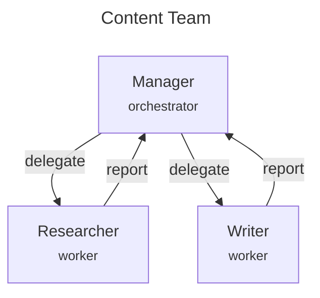

# Quickstart Guide

Get started with AgenticFlow in 5 minutes.

## Installation

```bash
# Using uv (recommended)
uv add agenticflow

# Using pip
pip install agenticflow
```

## Setup

Create a `.env` file with your OpenAI API key:

```bash
OPENAI_API_KEY=your-api-key-here
```

## Your First Agent

```python
import asyncio
from dotenv import load_dotenv
from agenticflow import Agent, AgentConfig, AgentRole, EventBus

load_dotenv()

async def main():
    # Create event bus for communication
    event_bus = EventBus()
    
    # Create a simple agent
    assistant = Agent(
        config=AgentConfig(
            name="Assistant",
            role=AgentRole.WORKER,
            model_name="gpt-4o-mini",
            system_prompt="You are a helpful assistant. Be concise.",
        ),
        event_bus=event_bus,
    )
    
    # Ask the agent to think about something
    response = await assistant.think("What is the capital of France?")
    print(response)

asyncio.run(main())
```

## Your First Multi-Agent System

```python
import asyncio
from dotenv import load_dotenv
from agenticflow import Agent, AgentConfig, AgentRole, EventBus
from agenticflow.topologies import SupervisorTopology, TopologyConfig

load_dotenv()

async def main():
    event_bus = EventBus()
    
    # Create a supervisor agent
    manager = Agent(
        config=AgentConfig(
            name="Manager",
            role=AgentRole.ORCHESTRATOR,
            model_name="gpt-4o-mini",
            system_prompt="""You coordinate a team of specialists.
Delegate tasks to: Researcher (facts), Writer (content).
Say 'task is complete' when finished.""",
        ),
        event_bus=event_bus,
    )
    
    # Create worker agents
    researcher = Agent(
        config=AgentConfig(
            name="Researcher",
            role=AgentRole.WORKER,
            model_name="gpt-4o-mini",
            system_prompt="You research topics and provide key facts.",
        ),
        event_bus=event_bus,
    )
    
    writer = Agent(
        config=AgentConfig(
            name="Writer",
            role=AgentRole.WORKER,
            model_name="gpt-4o-mini",
            system_prompt="You write engaging content based on research.",
        ),
        event_bus=event_bus,
    )
    
    # Create supervisor topology
    topology = SupervisorTopology(
        config=TopologyConfig(name="content-team", max_iterations=5),
        agents=[manager, researcher, writer],
        supervisor_name="Manager",
    )
    
    # Run with streaming to see progress
    print("🚀 Starting task...")
    async for state in topology.stream("Write a fun fact about octopuses"):
        if state.get("results"):
            latest = state["results"][-1]
            print(f"[{latest['agent']}]: {latest['thought'][:100]}...")
    
    print("✅ Done!")

asyncio.run(main())
```

## Topology Patterns

AgenticFlow provides several built-in coordination patterns:

### Supervisor (Hub-and-Spoke)
One manager delegates to workers:

```python
from agenticflow.topologies import SupervisorTopology

topology = SupervisorTopology(
    config=TopologyConfig(name="team"),
    agents=[manager, worker1, worker2],
    supervisor_name="manager",
)
```

### Pipeline (Sequential)
Agents process in sequence:

```python
from agenticflow.topologies import PipelineTopology

topology = PipelineTopology(
    config=TopologyConfig(name="pipeline"),
    agents=[stage1, stage2, stage3],
    stages=["stage1", "stage2", "stage3"],
)
```

### Mesh (Collaborative)
All agents can communicate:

```python
from agenticflow.topologies import MeshTopology

topology = MeshTopology(
    config=TopologyConfig(name="team"),
    agents=[analyst, critic, synthesizer],
)
```

## Adding Memory

```python
from agenticflow import memory_checkpointer

# Add memory to persist conversation state
topology = SupervisorTopology(
    config=TopologyConfig(name="team"),
    agents=[manager, worker1, worker2],
    supervisor_name="manager",
    checkpointer=memory_checkpointer(),  # Enables memory!
)

# Run with a thread_id to maintain context
result = await topology.run(
    "Continue our previous discussion",
    thread_id="conversation-123",
)
```

## Real-time Progress

Two ways to see progress as it happens:

### Option 1: Streaming (Async Generator)
```python
async for state in topology.stream("Your task"):
    if state.get("results"):
        print(f"Agent {state['current_agent']} responded")
```

### Option 2: Callback
```python
def on_progress(state):
    if state.get("results"):
        print(f"Progress: {len(state['results'])} steps completed")

result = await topology.run("Your task", on_step=on_progress)
```

## Visualize Your Topology

```python
# Generate a Mermaid diagram
diagram = topology.draw_mermaid()
print(diagram)

# Save to file
with open("topology.mmd", "w") as f:
    f.write(diagram)
```

Output:


## Next Steps

- [**Topologies Guide**](topologies.md) - Deep dive into coordination patterns
- [**Memory Systems**](memory.md) - Short-term, long-term, and semantic memory
- [**API Reference**](api-reference.md) - Complete API documentation
- [**Examples**](../examples/) - More runnable examples
