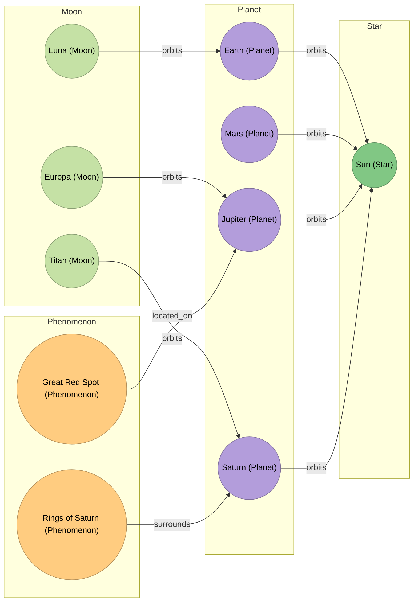

# Solar System Knowledge Graph

```mermaid
flowchart LR
    subgraph Moon
        moon(("Luna (Moon)"))
        europa(("Europa (Moon)"))
        titan(("Titan (Moon)"))
    end
    subgraph Phenomenon
        great_red_spot(("Great Red Spot (Phenomenon)"))
        saturn_rings(("Rings of Saturn (Phenomenon)"))
    end
    subgraph Planet
        earth(("Earth (Planet)"))
        mars(("Mars (Planet)"))
        jupiter(("Jupiter (Planet)"))
        saturn(("Saturn (Planet)"))
    end
    subgraph Star
        sun(("Sun (Star)"))
    end
    earth -->|orbits| sun
    mars -->|orbits| sun
    jupiter -->|orbits| sun
    saturn -->|orbits| sun
    moon -->|orbits| earth
    europa -->|orbits| jupiter
    titan -->|orbits| saturn
    great_red_spot -->|located_on| jupiter
    saturn_rings -->|surrounds| saturn
    classDef PlanetStyle fill:#B39DDB,stroke:#7d6d99,color:#000000
    classDef PhenomenonStyle fill:#FFCC80,stroke:#b28e59,color:#000000
    classDef StarStyle fill:#81C784,stroke:#5a8b5c,color:#000000
    classDef MoonStyle fill:#C5E1A5,stroke:#899d73,color:#000000
    class sun StarStyle
    class earth PlanetStyle
    class mars PlanetStyle
    class jupiter PlanetStyle
    class saturn PlanetStyle
    class moon MoonStyle
    class europa MoonStyle
    class titan MoonStyle
    class great_red_spot PhenomenonStyle
    class saturn_rings PhenomenonStyle
```
